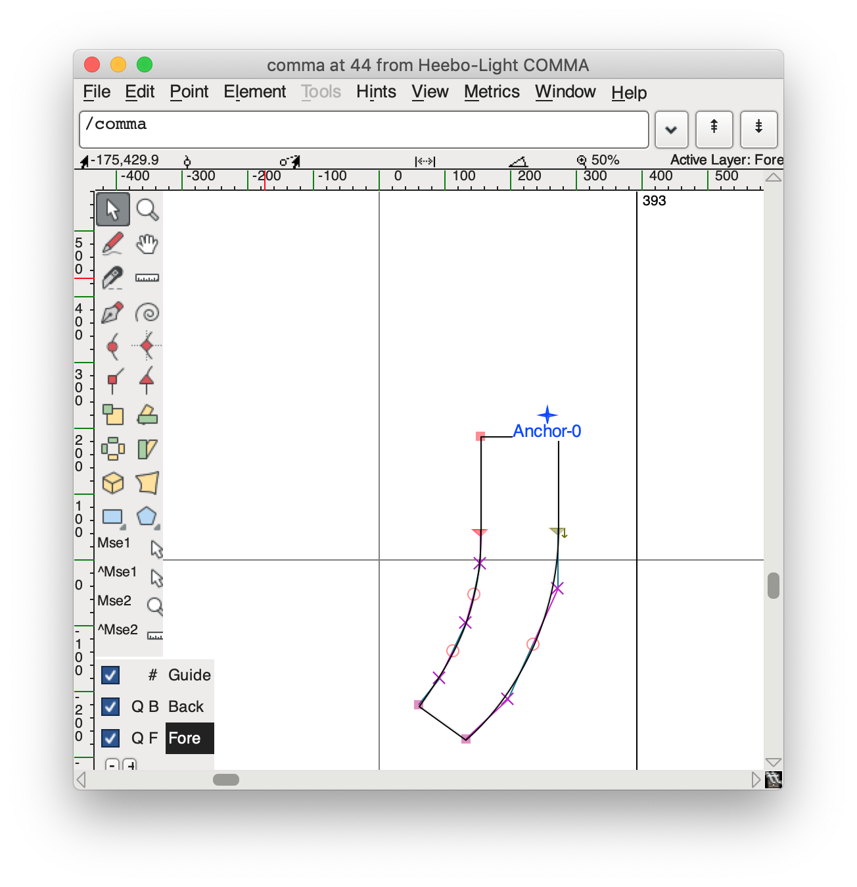

# Bad Render

We had encountered a strange issue on our website one day.  All copy that contained a `,` looked garbled.  For example, the text `Going, going, gone` looked like this:


After some investigating, we found out that commenting the following line in our CSS made text render properly again, albeit not in the font we wanted:

```
@import url('https://fonts.googleapis.com/css?family=Heebo:300,400,500,700,800,900&display=swap');
```

At the time, investigating the contents of that URL brought up the following:

```
$ curl 'https://fonts.googleapis.com/css?family=Heebo:300&display=swap'
@font-face {
  font-family: 'Heebo';
  font-style: normal;
  font-weight: 300;
  font-display: swap;
  src: url(https://fonts.gstatic.com/s/heebo/v6/NGSpv5_NC0k9P_v6ZUCbLRAHxK1E1yysdUmj.ttf) format('truetype');
}
```

Researching the Heebo font on [FontSquirrel](https://www.fontsquirrel.com/fonts/heebo), we found that it:

> is a Hebrew and Latin typeface family that includes Christian Roberton’s Roboto Latin and extends it into Hebrew.

Those commas hanging so low looked familiar.  They remindeded me of *nekuddot*, the system for Hebrew vowels.

# How Hebrew does vowels

For example, the Hebrew word for hello is *shalom*.  Written in Hebrew, that looks like:

> שׁלום


However, the above is purely just consonants.  The שׁ makes a *sh* sound, the ל makes a *l* sound, the ו normally makes a *v* sound, and the ם makes an *m* sound.  Unless you already know how to prounounce it, trying to read it from only the consonants, it could be read as *shee-loom*, *shel-um*, or *shul-vom*.

When Hebrew words are decorated with *nekuddot*, it disambiguates by providing the vowel sounds to use.  Here is *shalom* again, this time with *nekuddot*:

> שָׁלוֹם


The [*kamatz*](https://en.wikipedia.org/wiki/Kamatz) ( ָ) under the שׁ makes an *a* sound and the [*holam*](https://en.wikipedia.org/wiki/Holam) ( ֹ) over the ו makes on *o* sound.  Now it's unambiguous: *shalom*.

# A fix and further investigation

Since our website is in English and solely uses the Latin alphabet, we switched out Heebo for Roboto to resolve the actual incident.  With that behind us, we began investigating the font that Google was serving.

The `v6` in the response above looked suspect.  Could Google have released a buggy version of the font?

We eventually came across this issue: [Heebo font has some missing characters](https://github.com/google/fonts/issues/2453).

Jackpot.  *Lots* of other folks were experiencing the same issue we were.

# Resolution

Ultimately, the issue was this [upstream change to the Heebo font](https://github.com/TypeNetwork/heebo/pull/9/).

Eventually, a [new version of Heebo was published upsteam](https://github.com/TypeNetwork/heebo/pull/11) and deployed by Google.  At the time of this writing, running the same `curl` command yields the following:

```
curl 'https://fonts.googleapis.com/css?family=Heebo:300&display=swap'
@font-face {
  font-family: 'Heebo';
  font-style: normal;
  font-weight: 300;
  font-display: swap;
  src: local('Heebo Light'), local('Heebo-Light'), url(https://fonts.gstatic.com/s/heebo/v7/NGS3v5_NC0k9P9ldb6RMkKs.ttf) format('truetype');
}
```

Note that the `url` is now `v7`.

# Font anchors and diacritic marks

Now for the TIL.  The commit message from the [upsteam Heebo fix reads](https://github.com/TypeNetwork/heebo/pull/11):

> Spacing glyphs like comma, underscore and acute (, _ `) have anchors and are repositioned over or under when preceded by a letter with a matching anchor. They should not have anchors.
>
> This removes anchors from the following: comma, grave, underscore, quoteright, acute, circumflex, tilde, macron, dieresis, ring, cedilla.

I'd known about diacritic marks, but never thought about how they were implemented.  The answer is anchors and it's wonderfully straightforward.  From [Glyphs](https://glyphsapp.com/tutorials/diacritics):

> Anchors help connect base glyphs with marks.

"marks" here are any kind of diacritic: the *nekkudot* above, French accents like *aigu* or *grave*, or Spanish/Portuguese *tilde*.

Opening up the `v6` and the `v7` Heebo font in [FontForge](https://fontforge.org/) showed the errant anchor.

## Broken: Heebo v6


## Fixed: Heebo v7


# Try it yourself

Because the original fonts were hosted on Google fonts and they supposedly have to maintain stable URLs, we can actually see the two fonts side by side.  Check out this [small HTML file](heebo-compare.html) reproducing the original issue.
